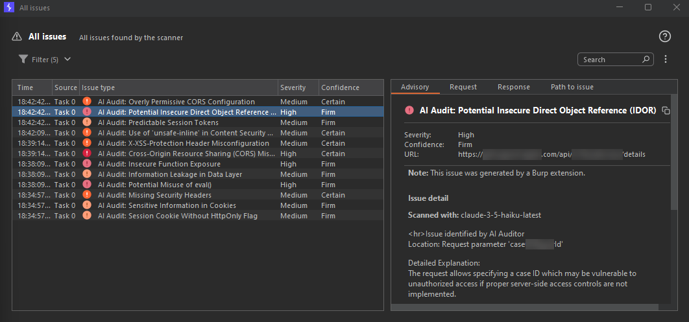
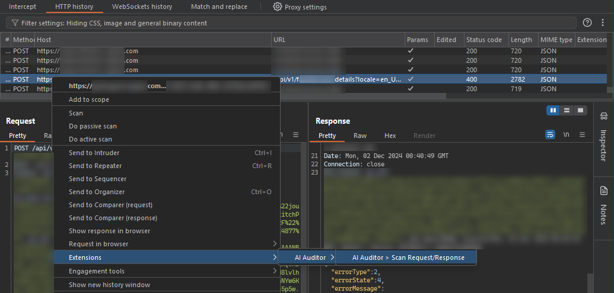

# AI Auditor: Burp Scan with GPT, Claude, Gemini (Pre-release)
**Author**: Richard Hyunho Im ([@richeeta](https://github.com/richeeta)) at [Route Zero Security](https://routezero.security)

## Description
Now available in pre-release, AI Auditor is an extension for Burp Suite Professional Edition and Burp Suite Enterprise Edition that integrates advanced large language models from OpenAI, Google, Anthropic, and Meta to add state-of-the-art AI capabilities to Burp Suite to enhance vulnerability scanning and analysis.

### Issues Reported by AI Auditor


### Scan Selected Text


### Scan Request/Response


## Changelog / Known Issues (Updated: 12/1/2024)
* **FIXED**: Gemini and Anthropic models will now add issues to the Scanner.
* **FIXED**: Scanner formatting issues.
* **FIXED**: API key validation for Anthropic.
* **ADDED**: Additional error handling.
* **KNOWN ISSUE**: Saved API keys may not persist across Burp sessions.

## Changelog / Known Issues (Updated: 11/29/2024)
* **ADDED**: Ability to scan selected portion of response.
* **FIXED (partially)**: some Scanner formatting issues.
* **FIXED**: API key validation for Anthropic & Google have been fixed.
* **FIXED**: `GPT-4o`, `GPT-4o-mini`, `o1-preview`, `o1-mini` should now work and add issues properly to the Scanner.
* **FIXED (partially)**: Gemini and Anthropic models will now respond, but the responses can only be viewed in the console for now.
* **FIXED**: Implemented concurrency and other performance optimizations: should no longer freeze.
* **REMOVED**: Context-aware analysis (due to insane performance overhead).

## Features
### Core Capabilities
* **Multi-Provider AI Integration**: **OpenAI** (`gpt-4o`, `gpt-4o-mini`, `o1-preview`, `o1-mini`), **Google Gemini** (`gemini-1.5-pro`, `gemini-1.5-flash`), **Anthropic Claude** (`claude-3-5-sonnet-latest`, `claude-3-5-haiku-latest`, `claude-3-opus-latest`)
* **Detailed Vulnerability Reporting**: Vulnerability description, location, exploitation methods, severity levels (`HIGH`, `MEDIUM`, `LOW`, `INFORMATIVE`) and confidence levels (`CERTAIN`, `FIRM`, `TENTATIVE`).
* **Custom Instructions**: Tailor the AI’s focus and analysis for special use cases.
* ~~**Context-Aware Analysis**: Configure number of requests/responses analyzed together (`0`—`5`).~~
* **API Key Verification**: Verify API keys instantly within the extension.
* **Integration with Burp Scanner**: Findings are automatically added to Burp’s issue tracker.
* ~~**Persistent Settings**: API keys and custom instructions will be saved and persist across sessions.~~

## Prerequisites
### For General Usage
* **Operating System**: Windows, macOS, or Linux.
* **API Key**: At least one valid API key for OpenAI, Google Gemini, or Anthropic Claude.
* **Burp Suite Professional Edition** or **Burp Suite Enterprise Edition** (**NOTE**: Burp Suite Community Edition is not supported).
### Additional Requirements to Build from Source
* **Java Development Kit (JDK) 17** or later
* **Apache Maven**

## Installation
### Building from Source
#### Windows
1. Install JDK 17:
```
winget install Microsoft.OpenJDK.17
```
2. Install Apache Maven:
```
winget install Apache.Maven
```
3. Clone and Build:
```
git clone https://github.com/richeeta/ai-auditor.git
cd ai-auditor
mvn clean package
```
#### macOS
1. Install Homebrew:
```
/bin/bash -c "$(curl -fsSL https://raw.githubusercontent.com/Homebrew/install/HEAD/install.sh)"
```
2. Install JDK 17 and Maven:
```
brew install openjdk@17 maven
```
3. Clone and Build:
```
git clone https://github.com/richeeta/ai-auditor.git
cd ai-auditor
mvn clean package
```
#### Linux (Ubuntu/Debian)
1. Install JDK 17 and Maven:
```
sudo apt update
sudo apt install openjdk-17-jdk maven
```
2. Clone and Build:
```
git clone https://github.com/richeeta/ai-auditor.git
cd ai-auditor
mvn clean package
```

The compiled JAR will be available at `target/ai-auditor-1.0-SNAPSHOT-jar-with-dependencies.jar`.

## Installation: Loading JAR in Burp Suite (Recommended)
1. [Download](https://github.com/richeeta/AIAuditor/releases/tag/v1.0.1-pre) the latest version in **[Releases](https://github.com/richeeta/AIAuditor/releases/tag/v1.0.1-pre)**.
2. Open **Burp Suite Professional Edition** or **Burp Suite Enterprise Edition**.
3. Navigate to the **Extensions** tab.
4. Click **Add**, select **Java** as the extension type, and upload the `JAR` file.
5. Click **Next** to load the extension.

## Usage
### Initial Setup
1. Go to the AI Auditor tab in Burp Suite.
2. Enter your API key(s) for OpenAI, Gemini, and/or Claude, then click **Validate** to confirm each key is working.
3. *Optional*: Add **Custom Instructions** to refine the analysis.
4. Save your settings.

### Analyzing Requests/Responses
#### Single Analysis
1. Right-click a request or response in Burp Suite.
2. Select **Extensions** > **AI Auditor** > **Scan Full Request/Response**.

#### Analyze Selected Portion Only
1. In a request or a response, highlight what you want to scan.
2. Right-click on your highlighted selection.
3. Select **Extensions** > **AI Auditor** > **Scan Selected Portion**.

### Review Results
Findings are displayed in Burp Scanner with detailed information.

## Usage Tips and Recommendations
### Avoid Scanning Large Responses
Large HTTP responses may exceed token limits and result in not only incomplete analysis but also degraded performance.

### Customize Instructions Effectively
To get the best results from the AI Auditor, provide clear and specific instructions. For example:
* **Ineffective**: `Analyze and report all legit security issues.`
* **Effective**: `Identify and list all API endpoints found in the JavaScript file.`

## FAQ
**Why isn’t Burp Suite Community Edition supported?**

The short answer: AI Auditor leans heavily on Burp Suite’s Scanner feature, and that’s a perk reserved for the Professional and Enterprise editions. Without it, the extension wouldn’t be able to tie findings neatly into Burp’s issue tracker or play nice with your existing workflows. It’s like trying to cook a gourmet meal on a campfire—it might work, but it won’t be pretty or efficient.

The longer answer: The Community Edition doesn’t have the Scanner, so I’d have to re-engineer the extension from scratch. We’re talking about building custom tools to display findings, track issues, and manage reports. Instead of seamlessly integrating with Burp Suite, this hypothetical version would be more like a standalone tool awkwardly bolted onto the side. It wouldn’t be the AI Auditor you know—it’d be something else entirely, with its own quirks and compromises.

Could I do it? Probably. Will I? Hopefully someday, but since I'd need to build this again from scratch (and make some tough calls about what features to keep, what to ditch, and how to make it useful without the polish that comes with the Pro/Enterprise Scanner), it's not on my immediate to do list.

**Will support for other models/providers be added?**

Yes, I plan to integrate Mistral and Llama 2 in future updates. 

**Why aren’t they included now?**

The short answer: time and complexity. Each new model requires careful integration, API key validation, testing, and optimization to ensure it doesn’t break the extension or your wallet.

I didn’t want to delay releasing AI Auditor while I worked on making every possible model under the sun play nice. Instead, I focused on OpenAI, Google Gemini, and Anthropic Claude because they’re well-established, high-quality, and widely used in the industry. That said, adding support for more models is a priority, and I’ll roll them out as soon as they meet the quality standards I aim for.

**Is this extension available in the BApp Store?**

Not yet—but it’s on the way! If you've used it, you probably know there are some quirks and kinks I need to iron out, but once I ensure everything runs smoothly, I will submit it to PortSwigger.

**Will my data remain private?**

**No**, and let me be extra clear about this: When you use AI Auditor, your requests and responses are sent to third-party APIs like OpenAI, Google, or Anthropic for processing. These APIs might and probably do log and analyze your data, at least to some extent. For that reason, I **strongly recommend using this extension only in non-sensitive or test environments**.

**What should I do if I encounter bugs or crashes?**

Please open a new issue. Include as much detail as possible—what you were doing, what went wrong, and any error messages you saw. The more I know, the faster I can fix it. Feedback is invaluable, and I genuinely appreciate users who take the time to report problems.

**Why are false positives or false negatives possible?**

AI models aren’t perfect—they’re probabilistic, not deterministic. This means they rely on patterns, probabilities, and sometimes a little educated guessing. Misinterpretations can happen, especially when instructions or context are vague. To minimize these hiccups, be specific in your instructions and provide clear, relevant data. The better the input, the sharper the output. Still, it’s always a good idea to double-check the findings before acting on them.

## Disclaimer

I am providing **AI Auditor** *as-is* ***strictly*** for educational and testing purposes. By using this tool, you agree that you will do so in accordance with all applicable laws of whatever jurisdiction you're in and the terms of service for the APIs used. If you're a criminal, please don't use this tool.

## License

This project is licensed under the GNU Affero General Public License v3.0.
